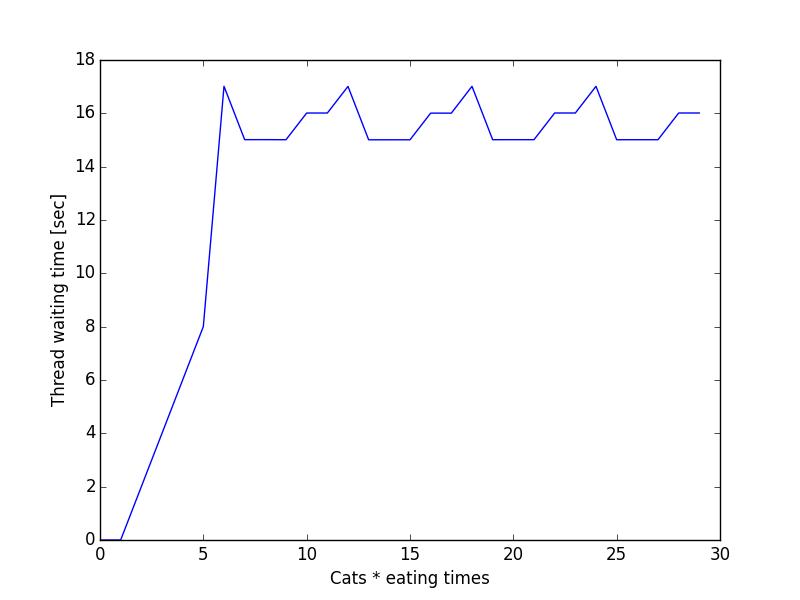
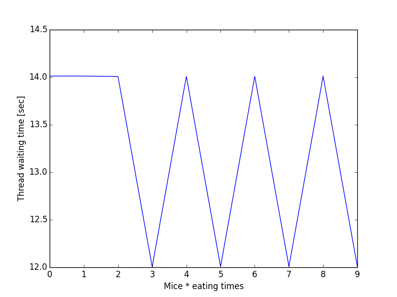
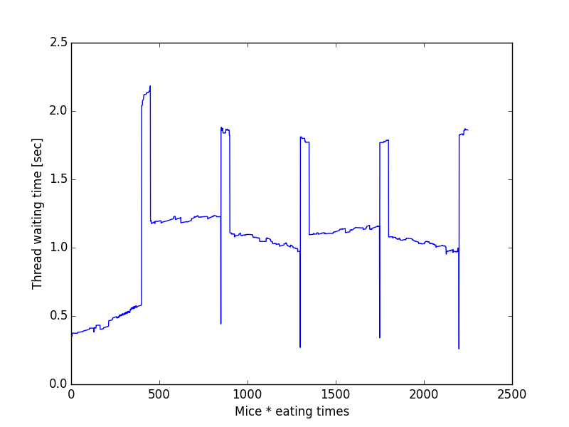
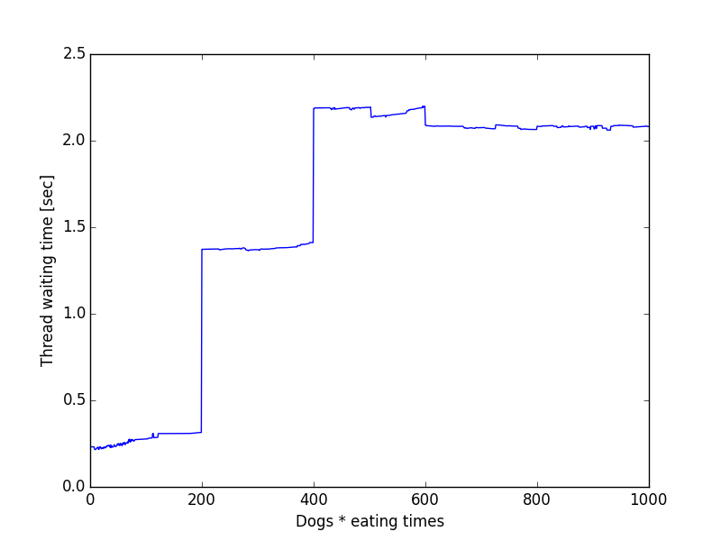

# L5-Design

## Inhaltsverzeichnis
- [Vorüberlegung](#vorüberlegung)
	- [Auswahl des Schedulers](#auswahl-des-schedulers)
- [Implementierung](#implementierung)
	- [Grundlegende Datenstrukturen](#grundlegende-datenstrukturen)
	- [Funktionsweise](#funktionsweise)
	- [Der Tierthread](#der-tierthread)
	- [Scheduling](#scheduling)
	- [Zeitmessung](#zeitmessung)
- [Auswertung](#auswertung)
	- [Test 1](#test-1)
	- [Test 2](#test-2)
	- [Test 3](#test-3)

- [Kritik](#kritik)
- [Weitere Quellen](#weitere-quellen)

## Vorüberlegung

### Auswahl des Schedulers:
In unserer Implementierung haben wir ein non-preemptive Round-Robin Scheduling ausgewählt, welcher mit Prioritäten arbeitet. 
Durch das Round-Robin System wird jegliche Möglichkeit einer Starvation eliminiert, da jedes Tier irgendwann drankommt. Wir definieren den Zustand Starvation als Threads die niemals
drankommen.
Es werden Tiere priorisiert, die eine niedrige satisfied-time haben. Sprich wenn sie schnell wieder essen wollen, kriegen sie eine höhere Priorität. Dadurch müssen solche Threads nicht zu lange warten.
Haben Tiere dieselbe satisfied-time, so wird das letzte genommen, da wir in einer Schleife das Minimum der satisfied-time berechnen und den Index dieses Tieres speichern.

Die Idee ist, das die Prioritäten ausbalanciert werden und jedes Tier dran kommt. 
Zum Beispiel:
Nehmen wir Default-Einstellung für den Scheduler, wobei die satisfied time für Katzen 15 sec, Hunde 10 sec und Mäuse 1 sec ist.
Die Mäuse beginnen zuerst weil die am schnellsten hungrig werden. Somit ergibt sich die folgende Ablaufreihenfolge für die Tiere:

| Tier 		| Runde 1 | Runde 2 | Runde 3 | Runde 4 | Runde 5 |
| ---------	| ------- | ------- | ------- | ------- | ------- |
| Katze 	| 14	  | 13	    | 12 	  | 11   	| 10      |
| Hunde 	| 9 	  | 8 	    | 7		  | 6   	| 5	      |
| Mäuse 	| 2 	  | 3 	    | 4 	  | 5 	    | 6       |

Nach der fünften Runde sind also die Hunde an der Reihe.

### Implementierung

#### Grundlegende Datenstrukturen

Bevor der Scheduler überhaupt implementiert werden kann, müssen die Grundbausteine implementiert werden.
In diesem Falle sind es die Tiergruppen, die Food-area und die Priority-queues.

Eine Tiergruppe ist ein struct und hat eine Anzahl, die es essen möchte `num_eat` (int), eine Zeit, die es braucht um zu essen `eating_time` (int), eine Zeit, die es verbringt, satt zu sein `satisfied_time` (int), einen Typ `animal_type` (char*) und eine `id` (int). 
Letzteres brauchen wir, um innerhalb der Gruppen zwischen jedem Tier, also jedem Thread, zu unterscheiden. Die Zeiten sind alle in Sekunden.

Die Food-area ist ebenfalls ein struct und besteht aus einer Anzahl `bowles` (int), einem Status `status` (char*) und einer Anzahl, wieviele Tiere momentan am Essen sind `num_eaten` (int).

Eine weitere Datenstruktur die Informationen über die Prioritäten speichert ist ~prio_queue_t`. 
Hierbei wird für jedes Tier und jede Tiergruppe die Prioritäten als int Wert abgespeichert. 
Die Hilfsfunktionen wie z.B. `nextGroup()` und `calcGroupPriorities()` arbeiten mit der Struktur. 
Ersteres traversiert über ein Array in dem die Gruppenprioritäten bestimmt sind und liefert den Index der wichtigsten Gruppe zurück. 
Die zweite Funktion balanciert die Prioritäten aus. Die aktuelle Gruppe verliert an Priorität, während die wartenden Gruppen wichtiger werden. 
Dies führt dazu, dass die Gruppen zwar zu Beginn recht unausgeglichen gewählt werden, jedoch langfristig alle Gruppen in fairer Weise drankommen. 

Weiterhin werden noch Hilfmatrizen genutzt. Die Matrix `threadDone[][]` speichert ob ein Thread pro Gruppe vollständig terminiert ist. 
Die `synchronize[][]` Matrix ist ein wichtiger Bestandteil des Synchronisationsmechanismus des Schedulers. Auf den wird später näher eingegangen.

Zudem sind in der API noch weitere Macros definiert, die den Code insgesamt verständlicher machen. Beispielsweise wird ein boolean-Typ definiert, wie man ihn normal kennt und es werden Katze, Hund, Maus, Anzahl Gruppen und die jeweiligen Farben definiert.

Die Tiere werden intern als 0 Katze, 1 Hund und 2 Maus referenziert.

#### Funktionsweise

Zu Anfang werden die Parameter eingelesen, die Variablen dementsprechend zugeordnet und Speicher allokiert. 
Nach den Zuweisungen und Ressourcenbereitstellung, werden die Threads nacheinander pro Gruppe gestartet. 
Wichtig hierbei ist, dass der Scheduler-Thread vor den Tier-Threads startet, da dieser ja entscheidet welcher Thread wann drankommt. 

#### Der Tierthread
Der Tierthread ist generisch definiert und nimmt über die Parameter seine Rolle als Tier an.
Wenn ein Thread startet, registriert sich dieser in einer Hilfmatrix `isReady[][]` und geht in den Suspend-Zustand, d.h. das Warten auf eine
Condition-Variable. Jeder Thread hat eine eigene Condition-Variable, die es ermöglicht, gezielt die Threads zu wecken.

Wenn ein Tier-Thread nun aufgewacht ist, belegt er eine Futterschüssel aus der Food-Area und frisst. Wenn die `eating_time` abgelaufen ist, verlässt der Thread die Futterschüssel, verringert die Laufvariablen und geht erneut in den Suspend-Zustand. Der Thread terminiert, sobald er die Anzahl an Fressen erfüllt hat.

Am Ende des Thread, kurz vor der Terminierung, wird in der 'threadDone' Matrix eingetragen, welches bedeutet, dass der aktuelle Thread beendet ist.

#### Scheduling
Der Scheduler-Thread ist der erste Thread der gestartet wird. Zu Beginn wird über die Funktion `nextGroup()` die Gruppe mit der wichtigsten Priorität bestimmt.
Anschließend verweilt der Scheduler im aktiven Warten, solange bis die Threads der jeweiligen Gruppe sich in der `isReady[][]` Matrix registriert haben.

Daraufhin holt sich der Scheduler über die Funktion `nextAnimal()` den Index der Condition-Variable des Tieres, mit der wichtigsten Priorität. 
Er weckt dann den Thread über ein Signal und verweilt dann im aktiven Warten, bis der geweckte Thread sich in der `sychronize[][]` Matrix registriert hat. 
Über diesen Mechanismus, wird ein serialisierter Ablauf gewährleistet. Weiterhin verfährt der Scheduler weiter, solange alle Tiere einer Gruppe an der Reihe waren. 
Wenn der Scheduler den letzten Thread weckt, wartet er erneut aktiv, bis alle Threads auch tatsächlich fertig sind. Die Funktion prüft, ob alle Threads sich aus der 'synchronize[][]'-Matrix
abgemeldet haben, denn erst dann darf der Scheduler den aktuellen Durchlauf beenden.

Anschließend werden über die Funktion `calcGroupPriorities[][]` die Prioritäten neu bestimmt, und der Scheduler verfährt erneut.
Der Scheduler terminiert, wenn die Funktion `nextGroup()` `-1` zurückgeliefert, denn dies bedeutet, dass alle Gruppen bereits fertig sind und somit der Scheduler keine
Arbeit mehr zu leisten hat.

#### Zeitmessung
Die Zeit pro Tierthread wird wie folgt gemessen: Jedesmal wenn ein Tierthread hungrig wird wird ein Zeitstempel gesetzt. 
Wenn dieser Thread durch den Scheduler aufgerufen wird, wird erneut ein Zeitstempel gesetzt. Die Differenz der beiden Zeitstempel wird die Matrix 'waitingTimes' eingetragen.
Am Ende des Scheduler-Threads, werden die Daten mit Hilfe der Funktionen `getMin()`, `getMax()` und `getAvg()` ausgewertet. Durch Hinzunahme des Arguments `--file` werden alle Wartezeiten der Threads, sowie die ausgewerteten Daten in eine Datei gespeichert. 
Ein Python Programm analysiert die Wartezeiten und zeichnet mit Hilfe der Matplotlib-Python-Bibliothek ein Diagramm. 

Das Diagramm enthält die Threads und deren Wartezeiten, wobei die X-Achse die Thread-Nummer * Anzahl eating_time beschreibt und die Y-Achse die Wartezeit in Sekunden.

### Auswertung
#### Test 1
Konfiguration: `./scheduler --ct 15 --dt 10 --mt 1 --ce 5 --de 5 --me 5 --cn 6 --dn 4 --mn 2 --e 1 --E 1 --dish 2`
oder auch einfach: `./scheduler`

* cat:
	+ Min: 3.918807 sec
	+ Max: 47.780954 sec
	+ Avg: 13.195758 sec
* dog:
	+ Min: 2.002028 sec
	+ Max: 10.947828 sec
	+ Avg: 5.168617 sec
* mouse:
	+ Min: 0.000060 sec
	+ Max: 1.000859 sec
	+ Avg: 0.380288 sec
	

Aufgrunddessen, dass die Mäuse über fünf Runden hinweg, die wichtigste Priorität haben, ergibt sich, dass die Mäuse eine extrem kurze Durchschnittswartezeit haben und daher auch sehr schnell fertig werden. 
Daraus resultiert, dass nach den Mäusen die Hunde und Katzen sich abwechselnd den Futterschüsseln bedienen, da
die Prioritäten zu diesem Zeitpunkt ausbalanciert sind.

Das erste Diagramm bezüglich der Mäuse zeigt deutlich wie wie schnell die Gruppen gewechselt werden, wenn die Gruppe anschließend wieder gewählt wird.

Dem Hundediagramm ist zu entnehmen, das vorallem zu Beginn und gegen Ende der Gruppen, die Wartezeit ansteigt während sie in der Mitte konstant verläuft. 
Genau wie bei den Mäusen beziehen sich die konstanten Wartezeiten auf die Phase in der nur die Hunde Gruppen ausgewählt werden. 
Gegen Ende erhalten die Katzen die Futterschüsseln und die Wartezeiten der Hunde steigt rasant an.

Die größten Wartezeiten haben die Katzen, denn per Definition werden die Tiergruppen bevorzugt, die schneller hungrig werden. 
Da eine Katze 15 sekunden braucht um hungrig zu werden, kann dieser Zeitraum effektiver durch andere Tiergruppen genutzt werden.
Das Katzendiagramm zeigt deutlich, dass zu Beginn zwar die Wartezeit sehr hoch, jedoch für die späteren Gruppen relativ konstant ist. 
Das führt auch dazu, dass die Katzen in einem viel geringeren Verhältnis zur maximalen Wartezeit im Durchschnitt warten müssen als die Hunde oder Mäuse.

So ergibt sich das die Katzen ca 3.6 mal kürzer Warten im Verhältnis zum Maximum.
Die Hunde warten dagegen 2 mal kürzer und die Mäuse 2.6 mal.

Es lässt sich sagen, dass das Scheduling vorallem bei großen unterschiedlichen satisfied-times zwar die durchschnittlichen Wartezeiten gut kompensiert, jedoch die maximale Wartezeiten enorm hoch sind, was Einbußen in Sachen Performance bringt.

#### Test 2
Konfiguration: `./scheduler --ct 1 --dt 2 --mt 3`

* cat:
	+ Min: 0.000164 sec
	+ Max: 17.014568 sec
	+ Avg: 13.208919 sec
* dog:
	+ Min: 9.008060 sec
	+ Max: 15.011772 sec
	+ Avg: 13.710153 sec
* mouse:
	+ Min: 12.005176 sec
	+ Max: 14.012406 sec
	+ Avg: 13.209468 sec
	

Der zweite Test enthält im Prinzip fast dieselben Einstellungen wie der Standardtest mit dem Unterschied, dass die satisfied time nicht so stark unterschiedlich ist, d.h. die Tiere werden in ein-Sekunden-Abständen später hungrig.
Die statistische Auswertung zeigt deutlich, es gibt zwar Abweichungen in den minimalen Wartezeiten, jedoch werden diese Unterschiede durch das Scheduling stark kompensiert. 
Daraus geht hervor, dass die Threads mit ähnlichen satisfied-times im Durchschnitt fast gleich lange warten.

Die Diagramme zeigen dies ebenfalls, wobei die Skalierung beachtet werden sollte.

Die Katzen-Threads starten zuerst. Nach der ersten Gruppe pendelt sich die Wartezeit relativ konstant ein. 
Nachdem die Katzengruppe fertig ist mit dem ersten Durchlauf, starten die Hunde Threads. 
Die ersten Threads hatten kurze Wartezeiten. Doch wie bei Katzen, pendeln sie die anderen Threads ebenfalls auf einen Wertebereich von 14 und 15 Sekunden ein.
Die darauffolgenden Mäuse-Threads verhalten sich analog, nach einer Wartezeit von 14 Sekunden beim ersten Thread, schwanken die Zeiten
im späteren Verlauf immer zwischen 12 und 14 Sekunden.

Es lässt sich erkennen, das der Scheduler bei ähnlichen oder zumindest weniger stark unterschiedlichen satisfied-times sich sehr fair verhält und die Tiere
abwechselnd drannimmt.

#### Test 3
Konfiguration `./scheduler --ct 1 --dt 2 --mt 3 --mn 450 --dn 200 --cn 300 --dish 400`

* cat:
	+ Min: 0.030358 sec
	+ Max: 3.937669 sec
	+ Avg: 2.968539 sec
* dog:
	+ Min: 0.215510 sec
	+ Max: 2.198910 sec
	+ Avg: 1.597863 sec
* mouse:
	+ Min: 0.259635 sec
	+ Max: 2.183882 sec
	+ Avg: 1.073892 sec

Der dritte Test soll ein Stresstest sein wobei hier Wert auf kurze Wartezeiten gelegt wird. Daher sind die Eingabeparameter dementsprechend optimiert.
Die Anzahl der Futterschüsseln bewirkt einen schnelleren Wechsel der Threads und somit eine kürzere Wartezeit. 
Wie bereits aus Test 2 bekannt, verläuft das Scheduling der Threads besonders fair, wenn die satisfied times in einem relativ ähnlichen Zeitfenster sind.

Die Katzen Threads starten zuerst, gefolgt von den Hunden und den Mäusen.  
Ein interessanter Aspekt ist hier, dass, obwohl die Katzen-Threads bevorzugt gewählt werden, sie trotzdem eine höhere durchschnittliche Wartezeit aufweist wie die Mäuse. 
Zu Beobachten ist dies auch im Diagramm der Katzen. Zu Beginn ist die Wartezeit sehr gering, doch
nach dem Gruppwechsel auf Hunde und Mäuse steigt sie rasant an. 
Das liegt zum Teil daran, dass die Anzahl der Tiere eine ebenso wichtige Rolle spielt, wie die Prioritäten. 
Die Katzen müssen schließlich auf die Hunde und Mäuse warten. Da es bei 450 Mäusen um 2250 Thread-Zyklen und bei 200 Hunden um 1000 Thread-Zykeln handelt, müssen die Katzen dementsprechend lange warten. 
Abgesehen von dem Gruppenwechsel, warten alle Threads ab einem Zeitpunkt konstant.
Besonders deutlich ist dies im Mäuse Diagramm sichtbar. Nach jedem Gruppenwechsel warten die Mäuse innerhalb ihrer Gruppe sehr wenig.

Durch die Erhöhung der Anzahl an Futterschüsseln können die Tier-Threads schneller an die 
Futterstelle. Wenn die Anzahl geringer wäre, müssten die Threads so lange warten, bis mindestens eine Schüssel frei ist. Dies kostet Zeit. 
So war auch zu Beginn die Annahme, dass vorallem die Mäuse die längeren Wartezeiten haben sollten. Doch dieses Experiment zeigt, dass nicht nur die Anzahl der Futterschüsseln sowie Priorität entscheidend ist, sondern ebenfalls die Anzahl der Threads.

## Kritik
Wie einige Tests bereits andeuteten, arbeitet der Scheduler vorallem dann gut, wenn die Prioritäten ähnlich sind bzw. sich geringfügig unterscheiden. 
Weiterhin kann die Performance durch die Erhöhung der Anzahl Futterschüsseln ebenfalls zunehmen, solange die Menge der Tiere nicht zu stark voneinander abweichen. 

Der Scheduler betrachtet im Prinzip die Gruppenprioritäten und entscheidet dann, welche der Gruppen wichtiger ist. Dies ist vorallem dann hilfreich, wenn die Threads relativ gleich lange essen und die Prioritäten sich voneinander gering unterscheiden, ähnlich wie im ersten Test.
Die Mäuse haben zusammengerechnet eine Essenszeit von maximal 10 Sekunden. Ein Hund wartet hingegen jeweils 15 Sekunden. 
So bietet es sich an alle Mäuse innerhalb dieses Zeitfensters "durchzuschleusen" sodass die Hunde längerfristig weniger warten müssen, da bereits ein Tier vollständig fertig ist. 

Ein Nachteil hierbei ergibt sich jedoch, wenn die Essenszeiten stark schwanken und keinen konstanten Wert haben. Dann fressen die Mäuse dementsprechend länger
während die Hunde hungrig werden. Das führt dazu, dass die Hunde länger warten.

Eine Möglichkeit zum besseren Scheduling wäre z.B. die nähere Betrachtung der Tierprioritäten. Der Scheduler wählt nicht nur anhand der satisfied time, sondern auch nach den Tieren. 
Jedes Tier könnte eine Priorität annehmen und nach bestimmten Kriterien diese berechnen. 
Die hungrigsten Tiere einer Gruppe würden gewählt werden und man hätte eine etwas ausbalancierte Lösung.

Letztenendes ist die Implementierung des Schedulers in wenigen Punkten verbesserungswürdig. Der markanteste Punkte hierbei ist, dass während die Tiere zwar nicht verhungern, sie in einem nicht außer Acht zu lassendem Zeitfenster warten.
