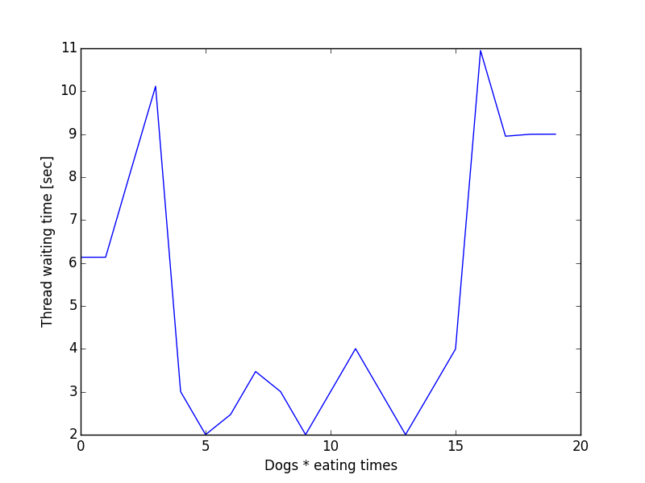

# L5-Design

## Inhaltsverzeichnis
- [Vorüberlegung](#vorüberlegung)
	- [Auswahl des Schedulers](#auswahl-des-schedulers)
- [Funktionsweise](#funktionsweise)
	- [Grundlegende Datenstrukturen](#vorüberlegung)
	- [Implementierung](#implementierung)
		- [Berechnung der Prioritäten](#berechnung-der-prioritäten)
		- [Funktionsweise eines Threads](#funktionsweise-eines-threads)
- [Kritik](#kritik)
- [Weitere Quellen](#weitere-quellen)

## Vorüberlegung

### Auswahl des Schedulers:
In unsere Implementierung haben wir für ein non-preemptive Round-Robin Scheduling ausgewählt, welcher mit Prioritäten arbeitet. 
Durch das Round-Robin System wird jegliche Möglichkeit einer Starvation eliminiert, da jedes Tier irgendwann drankommt.
Es werden Tiere priorisiert, die eine niedrige satisfied-time haben, sprich wenn sie schnell wieder essen wollen, kriegen sie eine höhere Priorität. Dadurch müssen solche Threads nicht zu lange warten.
Haben Tiere dieselbe satisfied-time, so wird das letzte genommen, da wir in einer Schleife das Minimum der satisfied-time berechnen und den Index dieses Tieres speichern.

Die Idee ist, das die Prioritäten ausbalanciert werden und jedes Tier dran kommt. 
Zum Beispiel:
Nehmen wir Default-Einstellung für den Scheduler, wobei die satisfied time für Katzen 15 sec, Hunde 10 sec und Mäuse 1 sec ist.
Die Mäuse beginnen zuerst weil die am schnellsten Hungrig werden. Somit ergibt sich die folgende Ablaufreihenfolge für die Tiere:

Katze 14, 	13, 	12, 	11, 	10 ...

Hunde 9, 	8, 	7,	6, 	5 ...

Mäuse 2, 	3, 	4, 	5, 	6 ...

Nach der fünften Runde ist der Hund an der Reihe.

### Implementierung

#### Grundlegende Datenstrukturen

Bevor der Scheduler überhaupt implementiert werden kann, müssen die Grundbausteine implementiert werden.
In diesem Falle sind es die Tiergruppen, die Food-area und die Prioritäten Queue.

Eine Tiergruppe ist ein struct und hat eine Anzahl, die es essen möchte `num_eat` (int), eine Zeit, die es braucht um zu essen `eating_time` (int), eine Zeit, die es verbringt satt zu sein `satisfied_time` (int), einen Typ `animal_type` (char*) und eine `id` (int). 
Letzteres brauchen wir, um innerhalb der Gruppen zwischen jedem Tier, also jedem Thread, zu unterscheiden. Die Zeiten sind alle in Sekunden.

Die Food-area ist ebenfalls ein struct und besteht aus einer Anzahl `bowles` (int), einem Status `status` (char*) und einer Anzahl, wieviele Tiere momentan am Essen sind `num_eaten` (int).

Eine weitere Datenstruktur die Informationen über die Prioritäten speichert ist 'prio_queue_t'. Hierbei wird für jedes Tier und jede Tiergruppe 
die Prioritäten als int Wert abgespeichert. Die Hilfsfunktionen wie z.B. 'nextGroup()' und 'calcGroupPriorities()' arbeiten mit der Struktur. Ersteres 
traversiert über ein Array in dem die Gruppenprioritäten bestimmt sind und liefert den Index der wichtigsten Gruppe zurück. Die zweite Funktion 
balanciert die Prioritäten aus. Die Aktuelle Gruppe verliert an Priorität, während die wartenden Gruppen wichtiger werden. Dies führt dazu, dass
die Gruppen zwar zu Beginn recht unausgeglichen gewählt werden, jedoch längerfristig alle Gruppen in fairer weise drankommen. 

Weiterhin enthält werden noch Hilfmatrizen genutzt. Die Matrix 'threadDone' speichert ob ein Thread pro Gruppe, ob er vollständig terminiert ist. 
Die 'synchronize' Matrix ist ein wichtiger Bestandteil des Synchronisationsmechanismus des Schedulers. Auf den wir später näher eingehen.

Zudem sind in der API noch weitere Macros definiert, die den Code insgesamt verständlicher machen. Beispielsweise wird ein boolean-Typ definiert, wie man ihn normal kennt und es werden Katze, Hund, Maus, Anzahl Gruppen und die jeweiligen Farben definiert.

Die Tiere werden intern als 0 Katze, 1 Hund und 2 Maus referenziert.

#### Funktionsweise

Zu Anfang werden die Parameter eingelesen, die Variablen dementsprechend zugeordnet und Speicher allokiert. 
Nach den Zuweisungen und Ressourcenbereitstellung, werden die Threads nacheinander pro Gruppe gestartet. 
Wichtig hierbei ist, dass der Scheduler-Thread vor den Tier-Threads startet, da dieser ja entscheidet welcher Thread wann drankommt. 

#### Der Tierthread
Der Tierthread ist generisch deffiniert und nimmt über die Parameter seine Rolle als Tier an.
Wenn ein Thread startet registriert dieser sich in einer Hilfmatrix 'isReady' und geht in den Suspend Zustand, dh. das warten auf eine
Condition Variable. Jeder Thread hat eine eigene Condition Variable, dies ermöglicht es, gezielt die Threads zu wecken.

Wenn ein Tier-Thread nun aufgewacht ist, belegt er eine Futterschüssel aus der Food-Area und frisst. Wenn die 'eating_time' abgelaufen ist, verlässt der Thread
die Futterschüssel, verringert die Laufvariablen und geht erneut in den Suspend Zustand. Der Thread terminiert, sobald er die Anzahl an Fressen erfüllt hat.

Am Ende des Thread, kurz vor der Terminierung, wird in der 'threadDone' Matrix eingetragen, dass der aktuelle Thread beendet ist.

#### Der Scheduler
Der Scheduler Thread ist der erste Thread der gestartet wird. Zu Beginn wird über die Funktion 'nextGroup' die Gruppe mit der wichtigsten Priorität bestimmt.
Anschließend verweilt der Scheduler im aktiven Warten, solange bis die Threads der jeweiligen Gruppe sich in der 'isReady' Matrix registriert haben.

Daraufhin holt sich der Scheduler über die Funktion 'nextAnimal' den Index der Condition Variable des Tieres, mit der wichtigsten Priorität und weckt den Thread über
ein Signal und verweilt dann im aktiven warten, bis der geweckte Thread sich in der 'sychronize' Matrix registriert hat. Über diesen Mechanismus, wird ein serialisierter
Ablauf gewährleistet. Weiterhin verfährt der Scheduler weiter, solange alle Tiere einer Gruppe drann waren. Wenn der Scheduler den letzten Thread weckt, wartet
er erneut aktiv, bis alle Threads auch tatsächlich fertig sind. Die Funktion prüft, ob alle Threads sich aus der 'sychronize' Matrix
abgemeldet haben, denn erst dann darf der Scheduler den aktuellen Durchlauf beenden.

Anschließend werden über die Funktion 'calcGroupPriorities' die Prioritäten neu bestimmt, und der Scheduler verfährt erneut.
Der Scheduler terminiert, wenn die Funktion 'nextGroup' -1 zurückgeliefert, denn dies bedeutet, dass alle Gruppen bereits fertig sind und somit der Scheduler keine
Arbeit mehr zu leisten hat.

#### Zeitmessung
Die Zeit pro Tierthread wird wie folgt gemessen. Jedesmal wenn ein Tierthread hungrig wird wird ein Zeitstempel gesetzt. Wenn dieser Thread durch
den Scheduler aufgerufen wird, wird erneut ein Zeitstempel gesetzt. Die Differenz der beiden Zeitstempel wird die Matrix 'waitingTimes' eingetragen.
Am Ende des Scheduler Threads, werden die Daten mit Hilfe der Funktionen 'getMin', 'getMax' und 'getAvg' ausgewertet. Durch hinzunahme des Arguments --file
werden alle Wartezeiten der Threads, sowie die ausgewerteten Daten in eine Datei gespeichert. Ein Python Programm analysiert die Wartezeiten und zeichnet
mit Hilfe der Matplotlib Python Bibliothek ein Diagramm. 

Das Diagramm enthält die Threads und deren Wartezeiten, wobei die X-Achse die Thread Nummer beschreibt und die Y-Achse die Wartezeit in Sekunden.

### Auswertung
#### Test 1
Konfiguration: ./scheduler --ct 15 --dt 10 --mt 1 --ce 5 --de 5 --me 5 --cn 6 --dn 4 --mn 2 --e 1 --E 1 --dish 2
oder auch einfach: ./scheduler

* cat:
	+ Min: 3.918807 sec
	+ Max: 47.780954 sec
	+ Avg: 13.195758 sec
* dog:
	+ Min: 2.002028 sec
	+ Max: 10.947828 sec
	+ Avg: 5.168617 sec
* mouse:
	+ Min: 0.000060 sec
	+ Max: 1.000859 sec
	+ Avg: 0.380288 sec
	

Aufgrunddessen, dass die Mäuse über fünf runden hinweg, die wichtigste Priorität haben, ergibt sich, dass die Mäuse eine extrem kurze Durchschnittswartezeit
haben und daher auch sehr schnell fertig werden. Daraus resultiert das nach den Mäusen, die Hunde und Katzen sich abwechselnd den Futterschüsseln bedienen, da
die Prioritäten zu diesem Zeitpunkt ausbalanciert sind.

Das erste Diagramm bezüglich der Mäuse zeigt deutlich wie wie schnell die Gruppen gewechselt werden, wenn die Gruppe anschließend wieder gewählt wird.

Dem Hundediagram ist zu entnehmen, das vorallem zu Beginn und gegen Ende der Gruppen, die Wartezeit ansteigt währen sie in der Mitte konstant verläuft. Genau wie 
bei den Mäusen beziehen sich die konstanten Wartezeiten auf die Phase in der nur die Hunde Gruppen ausgewählt werden. Gegen Ende, erhalten die Katzen die Futterschüsseln
und die Wartezeiten der Hunde steigt rasand an.

Die größten Wartezeiten haben die Katzen, denn per Deffinition, werden die Tiergruppen bevorzugt, die schneller hungrig werden. Da eine Katze 15 sekunden braucht
um hungrig zu werden, kann dieser Zeitraum effektiver durch andere Tiergruppen genutzt werden.
Das Katzendiagramm zeigt deutlich, das zu Beginn zwar die Wartezeit sehr hoch ist, jedoch für die späteren Gruppen relativ konstant. Das führt auch dazu,
das die Katzen in einem viel geringeren Verhältnis zur maximalen Wartezeit im durchschnitt Warten müssen als die Hunde oder Mäuse.

So ergibt sich das die Katzen ca 3,6 mal kürzer Warten im Verhätlnis zum Maximum.
Die Hunde warten dagegen 2 mal kürzer und die Mäuse 2,6 mal.

Es lässt sich sagen, dass das Scheduling vorallem bei großen unterschiedlichen satisfied times zwar die durchschnittliche Wartezeiten gut kompensiert, 
jedoch die maximale Wartezeiten enorm hoch sind, was einbußen in Sachen Performance bringt.

#### Test 2
Konfiguration: ./scheduler --ct 1 --dt 2 --mt 3 

## Kritik

## Weitere Quellen
